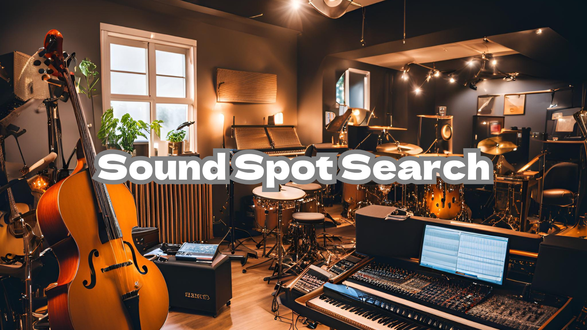

# Sound Spot Search
サービスURL：https://sound-spot-search.com/

 
 

# 楽器や歌を楽しむ人が、演奏の練習場所を探すサービスです。
アプリ上にはカラオケ・スタジオ・市民会館等の公共施設の3種の情報が登録されており、それらを地図や施設一覧から検索して「気軽に音を鳴らす場所」を見つけることができます。 
また、練習施設の口コミを他ユーザーと共有したり、my楽器の写真をコメント付きで投稿して他ユーザーに自慢することができます。
 
 

## ◼︎　開発背景
私は平日は会社員として勤務、休日は複数の吹奏楽団体やバンドに所属して管楽器演奏で音楽活動を行なっています。 
音楽活動の中で避けて通ることのできない、欠かせないことが「練習」です。 
ですが、自宅では騒音への配慮から音を出すことはできないため「練習場所の確保」には意外と苦労するなぁと感じることがあり、仲間内でもよく話題になります。 
「駅前のスタジオ、予約が埋まってて練習できない…カラオケも満室…。」 
「出先の隙間時間に練習したいけどあの辺りはよく知らなくて、練習できそうなとこってあるのかな…。」 
「あの文化会館って音楽室あるんだ！料金も安いし今まで損した気分。もっと早く知っていれば…」」 
そんな音楽ユーザーの悩みの声を解消したく、このサービスを発案しました。 
また、演奏活動を行う人々は自分の楽器がものすごく可愛いもので、我が子を自慢したくてしたくてたまりません。 
楽器のフォルムというものは眺めているだけでかっこいい…そうは思いませんか？ 
せっかく楽器を扱うユーザーが集うことを想定したサービスですので、 
my楽器の写真をコメント付きで投稿してユーザー同士で自慢し合えるできる機能も搭載しています。 
音楽の練習場所を探しながらユーザー同士楽器を眺めて、楽器好きのためのサービスを展開します。 

 
 

## ◼︎ 主要な機能
 - マップを用いた検索機能
 - 施設一覧から施設名・住所をフォームへ入力する検索機能
 - 施設の口コミ投稿機能
 - 施設をブックマークする機能
 - my楽器写真投稿機能
 - 他ユーザーのmy楽器をいいねする機能
 

## ◾︎ 検索機能について
### 🗺️ マップ検索機能
  - ピンの色分け（青:スタジオ・赤:カラオケ・緑:公共施設）により、

## ◼ サービスの差別化ポイント・推しポイント
 - 施設の情報だけでなく、演奏活動を行うユーザー視点での情報共有ができる。
 - カラオケとスタジオ、公共の施設が全てまとめて検索することができる。
 - 検索機能だけでなく、楽器自慢ができる。
   楽器の写真や楽器に関する情報を記載して発信して自慢し合うことができ、楽器愛に溢れたアプリとなる。
   練習場所だけでなく、人の楽器のセッティングを見ることで楽しく演奏活動のヒントを得ることもできる。
 

## ■ 機能
MVPリリース時
< 検索機能 >
- 基本的な施設情報（施設名、所在、公式サイトのURL、電話番号、料金）
- マップ検索

< 認証機能 >
- ユーザー登録
- ログイン、ログアウト機能
- ユーザー情報編集機能

< マイページ >
- ユーザープロフィール
- 口コミ投稿一覧
- ブックマーク一覧

本リリース時 
< 検索機能 >
- フリーワード検索（住所、駅名、施設名、カテゴリ）
- 追加の施設情報（施設備考タグ）

< 投稿機能 >
- 施設のブックマーク機能
- ユーザーが施設情報を編集できる機能
- 口コミ投稿機能
- my楽器投稿機能（写真、楽器の種類、コメント）
- 他ユーザーのmy楽器投稿一覧機能
- my楽器投稿へのいいね機能

< 認証機能 >
- パスワードリセット機能
- Googleアカウント認証機能

< その他 >
- 利用規約
- プライバシーポリシー

## ■ 機能の実装方針予定
使用する機能
| カテゴリ       | 使用技術                                                                                                              | 
| :------------: | :-------------------------------------------------------------------------------------------------------------------: | 
| サーバーサイド   | Rails 7.0.8.4・Ruby 3.2.2 |
| フロントエンド | Ruby on Rails・JavaScript・SCSS・HTML |
| CSSフレームワーク   | TailwindCSS + daisyUI|
| データベース   | PostgreSQL | 
| 環境構築       | Render・Docker | 
| CI/CD       | GitHub Actions | 
| Web API        | Google Maps API・Google Places API | 
| gem            | devise(ユーザー認証)・carrierwave(画像投稿,表示),   turbo-rails(ブックマーク、マップ)・ meta-tags(X共有機能の動的OGP導入) omniauth-google-oauth2(Googleアカウント認証) kaminari(ページネーション) | 

- 施設の情報をどのように集め、どのようにアプリに登録するか？ 
  ・「施設名」「所在」「公式サイトURL」「電話番号」 
    → Google Place APIを用いて、データを取得。csvファイルに落とし込む。csvファイルをrakeタスクを用いてデータベースへ落とし込む。 
    ※2025.03現在、都心エリアのみデータベース登録済み。順次エリア拡大予定。 
  ・「施設のルール等の備考」ほか、現況とアプリ内の情報が異なっていた場合 
    → ユーザーの編集による追加を想定。 

## 画面遷移図
https://www.figma.com/design/8ufxjUSCwOF9D7Y4nC7ZI3/Sound-Spot-Search_%E7%94%BB%E9%9D%A2%E9%81%B7%E7%A7%BB%E5%9B%B3?node-id=0-1&t=hnwtErcjwytmImqV-1

## ER図

